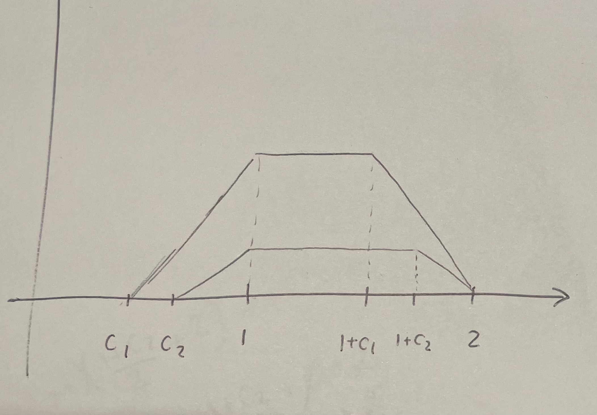
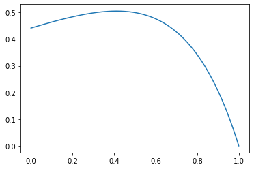

Each robot will have a strategy where they'll decide to sprint if their current position $x$ is smaller than a cutoff point (let's say $c$) or jump otherwise.

$$
\text{action}(x) = 
\begin{cases} 
	\text{sprint} & x < c \\
	\text{jump}   & x > c \\
\end{cases}
$$

To solve this problem, we'll first find the probability that the first robot wins as a function of each of the robot's cutoff point. Then we'll find the cutoff point that maximizes the probability of winning.

## 1) Finding the pdf of the position after jumping, and the probability of sprinting over the limit as function of the cutoff

As the robot starts at $x = 0$, it makes no sense to jump in the first move because it will always get a better score by sprinting first, since it's impossible to cross the limit line on the first sprint.

Let's say that $p_{\text{sprint 0}}(x)$ is the probability density function (pdf) of the position of the robot after the first sprint. Since the robot will sprint a number uniformly distributed in $[0,1]$, we have

$$
p_{\text{sprint 0}}(x) = 1 \quad \textrm{ for } x \in [0,1]
$$

For all values of $x < c$, the robot will sprint another time. What will be the pdf of the position of the robot after the second sprint? We just need to calculate the probability $p(X_0 + S = x)$, where $S$ is the uniform number in $[0,1]$ drawn for the second sprint, and $X_0$ is the position after the first sprint (but only values smaller than $c$, otherwise the robot wouldn't be sprinting a second time).

We can separate this function in 3 regions:

For $x < c$:  

$$
\begin{aligned}
p_{\text{sprint 1}}(X_0 + S = x) &= \int_0^xU(S = x - x_0)p_{\text{sprint 0}}(X_0 = x_0) \,dx_0\\\
&= \int_0^x 1 \,dx_0\ = x
\end{aligned}
$$

For $c < x < 1$:  

$$
\begin{aligned}
p_{\text{sprint 1}}(X_0 + S = x) &= \int_0^cU(S = x - x_0)p_{\text{sprint 0}}(X_0 = x_0) \,dx_0\\\
&= \int_0^c 1 \,dx_0\ = c
\end{aligned}
$$

For $1 < x$:  

$$
\begin{aligned}
p_{\text{sprint 1}}(X_0 + S = x) &= \int_{x-1}^cU(S = x - x_0)p_{\text{sprint 0}}(X_0 = x_0) \,dx_0\\\
&= \int_{x-1}^c 1 \,dx_0\ = c + 1 - x
\end{aligned}
$$

In the third region, the lower limit of the integral is $x-1$ because we have the limitation that the second sprint $s$ is smaller than $1$. Since $x_0 + s = x$, this implies $x_0 > x - 1$.

The pdf of the position of the robot after sprinting twice is:

$$
p_{\text{sprint 1}}(x) = 
\begin{cases} 
	x & 0 < x < c \\
	c & c < x < 1 \\
	c + 1 - x & 1 < x < 1 + c
\end{cases}
$$

Or, in other words, a nice trapezoid.

To find $p_{\text{sprint (n+1)}}(x)$, the pdf after the $(n+1)$-th sprint, we just need to do the same thing: find the pdf of the sum of two variables $X_n$ and $S$, where $X_n$ is drawn from $p_{\text{sprint n}}(x)$ and is smaller than $c$, and $S$ is drawn uniformly from $[0,1]$. If we keep doing that we'll find that the pdf after the $n$-th sprint is:

$$
p_{\text{sprint n}}(x) = 
\begin{cases} 
	x^n/n! & 0 < x < c \\
	c^n/n! & c < x < 1 \\
	(c^n - (x - 1)^n)/n! & 1 < x < 1 + c
\end{cases}
$$

Very nice. If you don't believe me, try proving this by induction. 

You may have noticed that for each $p_{\text{sprint n}}(x)$ some values are greater than $1$, even though the robot never jumped. These correspond to the times where the robot sprinted past the limit, and so the score for these will be zero. If we sum these values of $x \in [1, 1+c]$ for each $n$, we'll get the distribution of positions that correspond to a failed attemp:

$$
\begin{aligned}
p_{\text{fail}}(x) &= \sum_{n=0}^\infty \frac{c^n - (x - 1)^n}{n!}\\
&= e^c - e^{x-1}
\end{aligned}
$$

If we integrate that, we'll find the probability that the robot will sprint past the limit:

$$
\begin{aligned}
p_{\text{fail}} &= \int_1^{1+c} e^c - e^{x-1} \,dx\\\
&= 1 - (1-c)e^c
\end{aligned}
$$

Ok! Now what about the pdf of the position of the robot right before jumping? We know it will be zero for $x < c$, since the robot would need to sprint more before jumping, and it will be zero for $x > 1$, since the robot can't jump if it sprints over the limit. To get the pdf of $x$ before jumping we just need to sum all pdfs after sprinting for $x$ between $c$ and $1$:

$$
\begin{aligned}
p_{\text{before jump}}(x) &= \sum_{n=0}^\infty p_{\text{sprint n}}(x) \quad, x \in [c, 1]\\
&= \sum_{n=0}^\infty \frac{c^n}{n!}\\
&= e^c
\end{aligned}
$$

To find the pdf after the jump, we just need to find the distribution of the sum of two random variables, $X_{\text{before jump}} \sim p_{\text{before jump}}(x)$ and the jump $J \sim U(0, 1)$. This gives us:

$$
p_{\text{after jump}}(x) = 
\begin{cases} 
	(x-c)e^c & x \in [c,1] \\
	(1-c)e^c & x \in [1,1+c] \\
	(2-x)e^c & x \in [1+c,2] \\
\end{cases}
$$

Another very nice trapezoid.

## 2) Finding the probability of winning a round as a function of the pdf after jumping and the probability of sprinting over the limit

For the first robot to win a round, one of three scenarios must happen:

1. The first robot jumps farther than the second robot jumps
2. The first robot jumps and the second robot sprints over the limit
3. Both robots sprint over the limit, invalidating the first attempt, and the first robot wins on the second attempt

We can express this in this equation:

$$
\begin{aligned}
P_{\text{win}} &= P_{x_1 > x_2} + P_{\text{2 fails and 1 jumps}} + P_{\text{both fail}}P_{\text{win}}\\
P_{\text{win}} &= \frac{P_{x_1 > x_2} + P_{\text{2 fails and 1 jumps}}}{(1 - P_{\text{both fail}})}\\
\end{aligned}
$$

If we denote the first and the second robot's cutoff by $c_1$ and $c_2$, the probability that both robots sprint over the limit will be:

$$
P_{\text{both fail}} = (1 - (1-c_1)e^{c_1})(1 - (1-c_2)e^{c_2})
$$

And the probability that the second robot fails and the first one doesn't will be:

$$
P_{\text{2 fails and 1 jumps}} = (1-c_1)e^{c_1}(1 - (1-c_2)e^{c_2})
$$

Now comes a hard part of the problem. To calculate the probability that robot 1 jumps farther than robot 2 we'll need to calculate a double integral everywhere $x_2$ is smaller than $x_1$:

$$
P_{x_1 > x_2} = \int_{-\infty}^\infty \left( \int_{-\infty}^{x_1} p_2(x_2) \,dx_2\ \right) p_1(x_1) \,dx_1\ 
$$

(For the sake of simplicity, we're denoting $p_{\text{after jump}}(x)$ by $p(x)$). The computation of this integral can be divided into 5 different regions. Let's suppose $c_1$ is smaller $c_2$. If it's not, we can just switch $c_1$ and $c_2$ later.

To help visualize, see the 5 regions in the picture  


The regions are $[c_1, c_2]$, $[c_2, 1]$, $[, 1+c_1]$, $[1+c_1, 1+c_2]$, and $[1+c_2, 2]$.

### Region 1) $[c_1, c_2]$

$$
\begin{aligned}
P_{x_1 > x_2}^1 &= \int_{c_1}^{c_2} \left( \int_{c_1}^{x_1} 0 \,dx_2\ \right) p_1(x_1) \,dx_1\ \\
&= 0
\end{aligned}
$$

Lucky for us there's no value of $x_2$ between $c_1$ and $c_2$, so this regios will just be zero.

### Region 2) $[c_2, 1]$

$$
\begin{aligned}
P_{x_1 > x_2}^2 &= e^{c_2}e^{c_1}\int_{c_2}^{1} \left( \int_{c_2}^{x_1} x_2-c_2 \,dx_2\ \right) (x_1-c_1) \,dx_1\ \\
&= e^{c_2}e^{c_1}(1-c_2)^3(3 + c_2 - 4c_1)/24
\end{aligned}
$$

### Region 3) $[1, 1+c_1]$

$$
\begin{aligned}
P_{x_1 > x_2}^3 &= e^{c_2}e^{c_1} \int_{1}^{1+c_1}\left(\int_{c_2}^1 x_2 - c_2 \,d x_2\ + \int_1^x 1 - c_2 \,d x_2\ \right)(1-c_1) \,d x_1\ \\
&= e^{c_2}e^{c_1}(1-c_1)(1-c_2)c_1(1+c_1-c_2)/2
\end{aligned}
$$

### Region 4) $[1+c_1, 1+c_2]$

$$
\begin{aligned}
P_{x_1 > x_2}^3 &= e^{c_2}e^{c_1} \int_{1+c_1}^{1+c_2}\left(\int_{c_2}^1 x_2 - c_2 \,d x_2\ + \int_1^x 1 - c_2 \,d x_2\ \right)(2-x_1) \,d x_1\ \\
&= e^{c_2}e^{c_1} (1-c_2)(4c_1^3 - 3c_1^2(c_2+1) + 6c_1(c_2-1) - c_2(c_2^2 + 3c_2 - 6))/12
\end{aligned}
$$

### Region 5) $[1+c_2, 2]$

$$
\begin{aligned}
P_{x_1 > x_2}^3 &= e^{c_2}e^{c_1} \int_{1+c_1}^{1+c_2}\left(\int_{c_2}^1 x_2 - c_2 \,d x_2\ + \int_1^{1+c_2} 1 - c_2 \,d x_2\ + \int_{1+c_2}^{x_1} 2 - x_2 \,d x_2\ \right)(2-x_1) \,d x_1\ \\
&= e^{c_2}e^{c_1} (1-c_2)^3(3+c_2)/8
\end{aligned}
$$

If we now sum all of these functions we get... an exponential multiplied by a polynomial of 4th degree on two variables! By now you're probably exhausted of calculating these things by hand (or by using WolframAlpha). Now let's put a machine to do the heavy work for us.

## Finding the cutoff that maximizes the probability of winning

Given the chosen cutoff $c_2$ for robot 2, If there's a cutoff $c_1$ that maximizes the probability of robot 1 winning, then robot 1 will choose that $c_1$. Robot 2 can always set $c_2 = c_1$ so that his probability of winning is at least $\frac{1}{2}$. After a few iterations of this we'll hopefully converge to a cutoff value where every other value has a probability smaller than $0.5$ of winning against it. Both robots will set their cutoff to this value and their probability of winning will be $0.5$.

The first thing that comes to mind when thinking about finding the value of $c_1$ that maximizes $P_{\text{win}}$ is taking the derivative with respect to $c_1$ and setting it equal to zero. However, the expression for $P_{\text{win}}$ is such an enormously gigantic colossal monstrosity that we'd exhaust all the tress in the Amazon rainforest by trying to solve this on paper. For environmental reasons I'll leave the fun task of maximing $P_{\text{win}}$ for my computer.

First we gotta define $P_{\text{win}}$. In Python we can do:
```
import math

def a1(c1, c2):
	return (1-c2)**3(3+c2-4*c1)/24

def a2(c1, c2):
	return 0.5*(1-c1)*(1-c2)*c1*(1+c1-c2)

def a3(c1, c2):
	return (1-c2)*(4*c1**3 - 3*c1**2*(c2+1) 
					+ 6*c1*(c2-1) - c2*(c2**2 + 3*c2 -6))/12

def a4(c2):
	return (1-c2)**3*(3+c2)/8

def a_total(c1, c2):
	return math.exp(c1)*math.exp(c2)*(
		a1(c1,c2) + a2(c1,c2) + a3(c1,c2) + a4(c2))

def p_1_win(c1, c2):
	if (c1 > c2):
		return 1 - p_1_win(c2, c1)

	# Probability that robot 1 jumps farther than robot 2 jumps
	a = a_total(c1, c2)

	# Probability that robot 1 jumps and robot 2 fails
	b = (1-c1)*math.exp(c1)*(1 - (1-c2)*math.exp(c2))

	# Probability that both robots fail
	c = (1-(1-c1)*math.exp(c1))*(1-(1-c2)*math.exp(c2))

	return (a + b)/(1-c)
```

Notice that we made the assumption that $c_1$ is smaller than $c_2$ when calculating the expression for $P_{\text{win}}$. That's not a problem since the probability that robot 1 wins is just one minus the probability that robot 2 wins, so we can simply switch $c_1$ and $c_2$ if $c_1$ happens to be larger than $c_2$.

We can plot $P_{\text{win}}$ for a few values of $c_1$ and $c_2$ to get an idea of what it looks like:
```
import matplotlib.pyplot as plt

m = 10
for j in range(m):
    c2 = j/m
    n = 10000
    x = [i/n for i in range(n)]
    y = [p_1_win(c, c2) for c in x]

    print(f"c2 = {c2}")
    plt.plot(x, y)
    plt.show()
```

For example, here's what $P_{\text{win}}$ looks for a few different values of $c_1$ when $c_2 = 0.5$:



Here's a program that finds the $c_1$ which maximizes $P_{\text{win}}$ for a given $c_2$, and then sets $c_2 = c_1$ for a total of 10 iterations 

```
def best_c1_against(c2, start=0, end=1):
    n = 10000
    start_c = -1
    end_c = -1
    best_c = start
    best_y = 0
    print(f"c2 = {c2}")
    for i in range(n):
        c = start + (end-start)*i/n
        y = p_1_win(c, c2)
        if (y > 0.5):
            if (start_c == -1):
                start_c = c
            end_c = c
            if (y > best_y):
                best_y = y
                best_c = c
    print(f"[{start_c},{end_c}] best = {best_c} ({best_y})")
    if (best_c == start):
        print("no best found, increasing granularity")
        return best_c1_against(c2, (c2+start)/2, (c2+end)/2)
    else:
        return best_c

c = 0.4
for i in range(10):
    c = best_c1_against(c)
```

This returns $c = 0.4161953454498288$. By looking at some neighbouring points we can see that there are some better candidates for c.

```
def get_neighbourhood(x, dx, n=10000):
    return [x - dx + 2*dx*i/n for i in range(n)]

x = get_neighbourhood(c, 0.00003, n=10)
y = [p_1_win(xi,c) for xi in x]
print("\n".join([f"{xi}, {yi}" for (xi,yi) in zip(x,y)]))
```
If we do this manually a few times we soon hit a barrier: the numbers are not precise enough.
We need to rewrite the functions to use the `Decimal` Python class.

```
def decimal_a1(c1, c2):
    return (((1-c2)**4)/Decimal(4) - ((1-c2)**3)*(c1-c2)/Decimal(3))/Decimal(2)

def decimal_a2(c1, c2):
    return (1-c1)*(1-c2)*c1*(1+c1-c2)/Decimal(2)

def decimal_a3(c1, c2):
    return (1-c2)*(Decimal(4)*c1**3 - Decimal(3)*c1**2*(c2+1)
	    + Decimal(6)*c1*(c2-1) - c2*(c2**2 + Decimal(3)*c2
	    - Decimal(6)))/Decimal(12)

def decimal_a4(c2):
    return (1-c2)**3*(3+c2)/Decimal(8)

def decimal_a(c1, c2):
    return Decimal.exp(c1)*Decimal.exp(c2)*(decimal_a1(c1,c2)
	    + decimal_a2(c1,c2) + decimal_a3(c1,c2) + decimal_a4(c2))

def decimal_p_1_win(c1, c2):
    if (c1 > c2):
        return 1 - decimal_p_1_win(c2, c1)
    a = decimal_a(c1, c2)
    b = (1-c1)*Decimal.exp(c1)*(1 - (1-c2)*Decimal.exp(c2))
    c = (1-(1-c1)*Decimal.exp(c1))*(1-(1-c2)*Decimal.exp(c2))
    return (a + b)/(1 - c)
```

```
def decimal_get_neighbourhood(x, dec_places, n=10):
    dx = Decimal(1)/Decimal(10**dec_places)
    return [x - Decimal(n)*dx + dx*Decimal(i) for i in range(2*n)]
```
Now if we continue searching for the $c$ that maximizes $P_{\text{win}}$ like we were doing before, we quickly find this:
```
c = Decimal(41619535486)/Decimal(100000000000)
x = decimal_get_neighbourhood(c, 11, n=20)
y = [decimal_p_1_win(xi,c) for xi in x]
print("\n".join([f"{xi}, {yi}" for (xi,yi) in zip(x,y)]))
```
This prints out
```
[...]
0.41619535482, 0.4999999999999999999989703827
0.41619535483, 0.4999999999999999999994395124
0.41619535484, 0.4999999999999999999997674913
0.41619535485, 0.4999999999999999999999543209
0.41619535486, 0.5000000000000000000000000001
0.41619535487, 0.4999999999999999999999045296
0.41619535488, 0.4999999999999999999996679087
0.41619535489, 0.4999999999999999999992901381
0.41619535490, 0.4999999999999999999987712171
[...]
```

The best $c$ seems to be $0.41619535486$. If we now calculate the probability of failing the first attempt:
```
p = round(1 - (1-c)*Decimal.exp(c), 9)
```
This gives the following answer
```
0.114845886
```